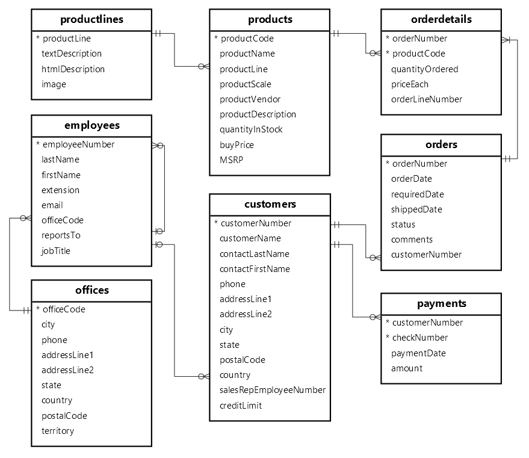
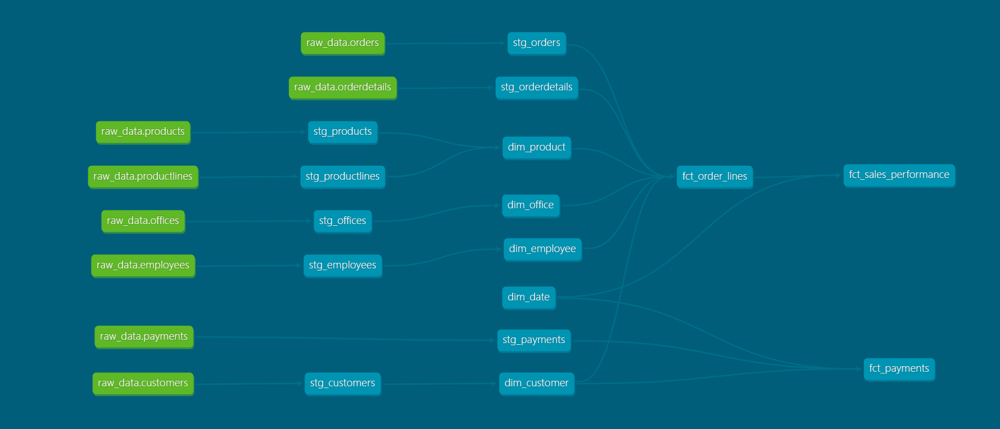

# 📊 End-to-End Data Warehouse with dbt & DuckDB: Classic Models Case Study

## 📋 Deskripsi Proyek
Proyek ini mendemonstrasikan pembangunan Data Warehouse modern menggunakan arsitektur **Medallion (Staging, Dimensions, dan Marts)**. Menggunakan dataset **Classic Models**, proyek ini mengotomatisasi transformasi data menggunakan **dbt (data build tool)** dengan **DuckDB** sebagai engine database yang cepat dan efisien.

Tujuan utamanya adalah mengubah data operasional mentah menjadi *Business Intelligence Ready-Data* yang tervalidasi dan siap untuk analisis strategis.

### **🗺️ Source Data Architecture (ERD)**
Sebelum proses transformasi dimulai, berikut adalah struktur data mentah (*source*) yang digunakan dalam proyek ini:



> **Catatan:** ERD di atas menunjukkan hubungan antar tabel operasional seperti `Customers`, `Orders`, `Payments`, dan `Employees` yang menjadi fondasi dalam pembentukan model Dimensi dan Fakta di tahap berikutnya.
---

## 🛠️ Tech Stack
- **Transformation:** dbt-core & dbt-duckdb
- **Database Engine:** DuckDB
- **Environment:** Google Colab / Local Python Environment
- **Languages:** SQL (Jinja) & Python
- **Documentation:** dbt-docs (DAG)

---

## 🏗️ Arsitektur Data (Lineage)
Proyek ini mengikuti standar praktik terbaik pemodelan data:
1. **Sources**: Ingesti data mentah dari CSV ke DuckDB schema `main`.
2. **Staging Layer (`stg_`)**: Pembersihan awal, standarisasi tipe data, dan aliasing kolom ke *snake_case*.
3. **Core Layer (Dimensions & Marts)**:
    - **Dimensions (`dim_`)**: Master data deskriptif (Customers, Products, Employees, Date).
    - **Fact Tables (`fct_`)**: Tabel transaksi kuantitatif (Orders, Payments).

---

## 🚀 Alur Pelaksanaan Proyek

### 1. Inisialisasi & Load Data
Langkah awal meliputi instalasi library dan memuat file CSV ke database `classicmodels.duckdb`.
```bash
!pip install dbt-duckdb
!python 'load_source_py'
```
### 2. Konfigurasi dbt (Profiles & Project)

Menghubungkan dbt dengan database DuckDB melalui file konfigurasi:

* **`profiles.yml`**: Mengatur target database dan lokasi file `.duckdb`.
* **`dbt_project.yml`**: Mengatur strategi materialisasi (View/Table).

```bash
!dbt debug --profiles-dir .

```

### 3. Membangun Staging Layer
Tahap ini berfungsi sebagai lapisan pembersihan. Data mentah ditransformasikan menjadi format yang konsisten tanpa mengubah logika bisnis yang kompleks.
- **stg_customers**: Standarisasi profil pelanggan, termasuk pemetaan ID pelanggan dan penghubungan dengan ID perwakilan penjualan (sales rep).
- **stg_employees**: Standarisasi data karyawan, struktur pelaporan (siapa melapor ke siapa), dan informasi jabatan.
- **stg_offices**: Standarisasi informasi lokasi kantor cabang, nomor telepon, dan wilayah (territory).
- **stg_payments**: Pembersihan data transaksi pembayaran, mencakup nomor cek, tanggal bayar, dan nilai nominal.
- **stg_products**: Standarisasi katalog produk, termasuk informasi skala produk, stok, harga beli, dan MSRP.
- **stg_productlines**: Standarisasi kategori lini produk beserta deskripsi tekstualnya.
- **stg_orders**: Pembersihan data header pesanan, pemformatan tanggal (order, required, shipped), dan pelacakan status pesanan.
- **stg_orderdetails**: Penyiapan data detail item per pesanan, termasuk jumlah yang dipesan dan harga per unit untuk perhitungan nilai transaksi.

### 4. Membangun Model Dimensi (Core Layer)
Mengorganisir data ke dalam tabel dimensi deskriptif. Tabel-tabel ini menggunakan materialisasi **Table** untuk akses data yang lebih cepat.
- **dim_customers**: Master data pelanggan yang terkonsolidasi.
- **dim_products**: Informasi detail produk beserta kategori (*product line*).
- **dim_date**: Tabel referensi waktu (2003-2006) untuk mendukung analisis tren temporal.
- **dim_employee**: Pemodelan hirarki organisasi, memetakan hubungan antara karyawan dan manajer.
- **dim_office**: Informasi lengkap mengenai kantor operasional sebagai entitas pendukung distribusi.

### 5. Membangun Tabel Fakta (Fact Tables)
Puncak dari proses pemodelan data di mana metrik bisnis utama dihitung.
- **fct_orderlines**: Tabel fakta tingkat granularitas baris pesanan. Menggabungkan pesanan dengan dimensi produk dan pelanggan untuk menghitung Revenue, Cost (HPP), dan Gross Profit secara mendetail untuk setiap item yang terjual.
- **fct_sales_performance**: Tabel agregat untuk memantau kinerja penjualan berdasarkan perwakilan penjualan (sales rep) dan kantor. Menyediakan metrik ringkasan seperti jumlah pesanan unik, total unit terjual, serta rata-rata pendapatan per baris pesanan.
- **fct_payments**: Menyediakan catatan arus kas masuk. Menghubungkan transaksi pembayaran pelanggan dengan tabel dimensi pelanggan untuk analisis tren pembayaran dan piutang.
- **Data Integrity**: Melakukan pengujian (`dbt test`) untuk memastikan tidak ada nilai null pada kunci utama dan menjaga integritas referensial antar tabel.

### 6. Eksplorasi Data Marts (Business Analytics Scenarios)
Setelah Data Warehouse siap, kita mensimulasikan peran sebagai Data Analyst untuk menjawab 5 skenario strategis:

* **Skenario 1: Identifikasi Produk "High-Volume, Low-Margin"**
    Menemukan produk dengan volume penjualan tinggi namun margin keuntungan tipis untuk optimalisasi strategi promosi dan harga.
* **Skenario 2: Analisis Likuiditas (Sales vs Payment)**
    Membandingkan nilai transaksi penjualan yang dikirim terhadap realisasi pembayaran tunai untuk memantau kesehatan piutang (*Account Receivable*).
* **Skenario 3: Evaluasi Efisiensi Sales Representative**
    Mengukur kontribusi setiap karyawan penjualan terhadap total revenue berdasarkan portofolio pelanggan yang mereka kelola.
* **Skenario 4: Pemetaan Tren Penjualan Musiman**
    Menganalisis fluktuasi pendapatan bulanan menggunakan `dim_date` untuk mendeteksi pola musiman guna persiapan inventaris.
* **Skenario 5: Optimalisasi Operasional Kantor Cabang**
    Memetakan performa penjualan berdasarkan wilayah geografis kantor untuk menentukan alokasi sumber daya operasional yang lebih efektif.

### 7. Visualisasi Silsilah Data (dbt DAG)
Proyek ini menyertakan dokumentasi teknis otomatis. **DAG (Directed Acyclic Graph)** memvisualisikan silsilah data dari sumber CSV hingga ke tabel final di lapisan Marts.



**Instruksi Menjalankan Dokumentasi:**
- **Lokal:** Jalankan perintah `!dbt docs serve`.
- **Google Colab:** Menggunakan server Python HTTP internal dan `proxyPort` untuk mengakses antarmuka interaktif dbt-docs.

---

## 📂 Struktur Folder Proyek
```text
├── analyses/           # Tempat menyimpan query SQL untuk eksplorasi ad-hoc
├── dataset/          # Raw Data: Sumber file .csv (customers, orders, dll.)
├── logs/             # File dbt.log: Catatan detail eksekusi & error query
├── macros/           # Folder khusus untuk menyimpan file .sql berisi macro
├── models/
│   ├── staging/      # View: Pembersihan & Standarisasi
│   ├── dimensions/   # Table: Master Data Deskriptif
│   └── marts/        # Table: Fakta & Metrik Bisnis
├── snapshots/          # Mekanisme Slowly Changing Dimensions (SCD)
├── target/             # Hasil kompilasi dbt, manifest.json, & metadata dokumentasi
├── tests/              # Custom data tests (Singular tests)
├── classicmodels.duckdb    # Database utama (Serverless Data Warehouse)
├── dbt_classicmodels_dw.ipynb # Orchestrator & Dashboard sederhana
├── dbt_project.yml     # Konfigurasi utama proyek, resource paths, & materialisasi
├── load_source.py      # Script Python untuk memuat data mentah ke database awal
├── profiles.yml        # Kredensial & konfigurasi koneksi database (DuckDB)
└── README.md           # Dokumentasi proyek, cara instalasi, dan panduan penggunaan
├── requirements.txt    # Daftar dependensi Python (dbt-duckdb, pandas, dll.)

